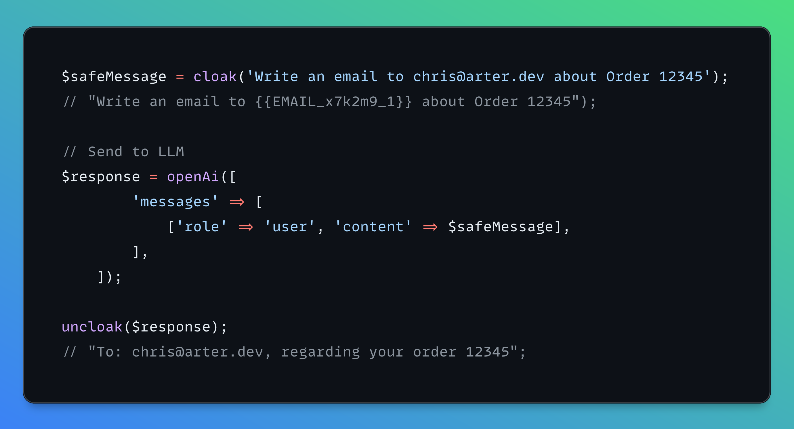

# Cloak for Laravel

<p align="center">
  
</p>

[](https://packagist.org/packages/dynamikdev/cloak-laravel)
[](https://github.com/dynamik-dev/cloak-laravel/actions?query=workflow%3Arun-tests+branch%3Amain)
[](https://packagist.org/packages/dynamikdev/cloak-laravel)

**Keep PII out of LLMs.** Cloak masks sensitive data before sending text to AI APIs like ChatGPT or Claude, then restores the original data in responses.

## Quick Start

```php
// Mask PII before sending to an LLM
$safe = cloak('Contact john@example.com or call 555-123-4567');
// "Contact {{EMAIL_x7k2m9_1}} or call {{PHONE_x7k2m9_1}}"

// Restore the original data
$original = uncloak($safe);
// "Contact john@example.com or call 555-123-4567"
```

## Why Cloak?

When building AI-powered features, user messages often contain sensitive information—emails, phone numbers, SSNs, credit cards. Sending this data to third-party LLM APIs creates privacy and compliance risks.

Cloak solves this by:
1. **Detecting** PII using built-in or custom detectors
2. **Replacing** sensitive data with placeholder tokens
3. **Storing** the mapping temporarily (in-memory or cache)
4. **Restoring** original data when you receive the LLM's response

The LLM never sees the actual PII, but your users get personalized responses.

## Installation

```bash
composer require dynamikdev/cloak-laravel
```

Optionally publish the config file:

```bash
php artisan vendor:publish --tag="cloak-config"
```

## Configuration

```php
// config/cloak.php
return [
    // false (default): In-memory storage, auto-cleared after request
    // true: Cache storage, persists across requests
    'persist' => env('CLOAK_PERSIST', false),

    // Storage driver class when persist is true
    'storage_driver' => DynamikDev\Cloak\Laravel\CacheStorage::class,

    // Cache store to use (null = default cache)
    'cache_store' => env('CLOAK_CACHE_STORE'),

    // TTL for cached mappings in seconds
    'default_ttl' => env('CLOAK_DEFAULT_TTL', 3600),
];
```

### Encryption at Rest

This Laravel adapter integrates with cloak-php v0.2.0's encryption system using Laravel's `Crypt` facade. All sensitive data is encrypted before being stored, providing defense in depth—even if memory or cache is compromised, the original PII remains protected.

The encryption is handled through a custom `LaravelEncryptor` that implements cloak-php's `EncryptorInterface`, using Laravel's built-in encryption for seamless integration with your application's `APP_KEY`.

### Persist Mode

- **`persist: false`** (default) - In-memory storage with encryption. Perfect for single-request flows where you cloak → call LLM → uncloak in one request. Data is automatically garbage collected when the request ends.

- **`persist: true`** - Laravel cache storage with encryption. Use this when you need to uncloak in a different request (e.g., webhook responses, queued jobs). TTL is configurable via `default_ttl`.

## Usage

### Helper Functions

The simplest way to use Cloak:

```php
$masked = cloak($text);
$restored = uncloak($masked);
```

### Facade

```php
use DynamikDev\Cloak\Laravel\Facades\Cloak;

$masked = Cloak::cloak($text);
$restored = Cloak::uncloak($masked);
```

### Dependency Injection

```php
use DynamikDev\Cloak\Cloak;

class ChatController extends Controller
{
    public function send(Request $request, Cloak $cloak)
    {
        $safe = $cloak->cloak($request->input('message'));
        // ...
    }
}
```

## Real-World Example: OpenAI Integration

```php
use OpenAI\Laravel\Facades\OpenAI;

public function chat(Request $request)
{
    $userMessage = $request->input('message');
    // "Help me email john.doe@acme.com about invoice #1234.
    //  My number is 555-867-5309 if they need to call back."

    // 1. Cloak PII before sending to OpenAI
    $safeMessage = cloak($userMessage);
    // "Help me email {{EMAIL_a1b2c3_1}} about invoice #1234.
    //  My number is {{PHONE_a1b2c3_1}} if they need to call back."

    // 2. Send to OpenAI - no PII exposed to the API
    $response = OpenAI::chat()->create([
        'model' => 'gpt-4',
        'messages' => [
            ['role' => 'system', 'content' => 'You are a helpful assistant.'],
            ['role' => 'user', 'content' => $safeMessage],
        ],
    ]);

    // 3. Get the response (LLM uses placeholders naturally)
    $aiResponse = $response->choices[0]->message->content;
    // "Here's a draft email for {{EMAIL_a1b2c3_1}}:
    //  Subject: Regarding Invoice #1234..."

    // 4. Restore PII for the user
    $finalResponse = uncloak($aiResponse);
    // "Here's a draft email for john.doe@acme.com:
    //  Subject: Regarding Invoice #1234..."

    return response()->json(['response' => $finalResponse]);
}
```

## Built-in Detectors

Cloak automatically detects:

| Type | Example | Placeholder |
|------|---------|-------------|
| Email | `john@example.com` | `{{EMAIL_x1y2z3_1}}` |
| Phone | `555-123-4567` | `{{PHONE_x1y2z3_1}}` |
| SSN | `123-45-6789` | `{{SSN_x1y2z3_1}}` |
| Credit Card | `4111-1111-1111-1111` | `{{CREDIT_CARD_x1y2z3_1}}` |

By default, all detectors run. To use specific detectors:

```php
use DynamikDev\Cloak\Detector;

// Only detect emails and phones
$masked = cloak($text, [
    Detector::email(),
    Detector::phone(),
]);

// Phone detection with region hint (improves accuracy)
$masked = cloak($text, [
    Detector::phone('US'),
]);
```

## Custom Detectors

### Pattern Detector (Regex)

```php
use DynamikDev\Cloak\Detector;

// Detect database connection strings
$masked = cloak($text, [
    Detector::pattern(
        '/mysql:\/\/[^:]+:[^@]+@[^\s]+/',
        'DB_CONNECTION'
    ),
]);

// Detect API keys
$masked = cloak($text, [
    Detector::pattern(
        '/sk-[a-zA-Z0-9]{32,}/',
        'API_KEY'
    ),
]);
```

### Word Detector

```php
use DynamikDev\Cloak\Detector;

// Mask specific names or terms (case-insensitive)
$masked = cloak($text, [
    Detector::words(['John Doe', 'Jane Smith', 'Acme Corp'], 'NAME'),
]);
```

### Callback Detector

For complex detection logic:

```php
use DynamikDev\Cloak\Detector;

$masked = cloak($text, [
    Detector::using(function (string $text) {
        // Return array of ['match' => '...', 'type' => '...']
        $matches = [];

        // Example: Find Laravel env variables
        if (preg_match_all('/\bDB_PASSWORD=\S+/', $text, $found)) {
            foreach ($found[0] as $match) {
                $matches[] = ['match' => $match, 'type' => 'ENV_VAR'];
            }
        }

        return $matches;
    }),
]);
```

## Middleware Example

Auto-cloak sensitive data in request logs:

```php
namespace App\Http\Middleware;

use Closure;
use Illuminate\Http\Request;
use Illuminate\Support\Facades\Log;

class LogSafeRequests
{
    public function handle(Request $request, Closure $next)
    {
        // Log request with PII masked
        Log::info('API Request', [
            'path' => $request->path(),
            'body' => cloak(json_encode($request->all())),
        ]);

        return $next($request);
    }
}
```

## Testing

```bash
composer test
```

## Version Compatibility

This package has been updated to work with **cloak-php v0.2.0**, which includes:

- New builder pattern API for configuring Cloak instances
- Pluggable encryption system via `EncryptorInterface`
- Enhanced lifecycle hooks and filtering capabilities
- Simplified storage interface (TTL handling moved to storage implementations)

### What Changed in v0.2.0

**Architecture improvements:**
- Now uses cloak-php's `ArrayStore` for in-memory storage (instead of custom `EncryptedArrayStorage`)
- Implements a `LaravelEncryptor` that integrates with Laravel's `Crypt` facade
- Service provider uses the builder pattern: `Cloak::using($store)->withEncryptor($encryptor)`
- Uses `Cloak::resolveUsing()` to integrate with Laravel's container
- Helper functions now provided by core package (Laravel-specific helpers removed)
- TTL configuration is Laravel-specific and handled within `CacheStorage` constructor

**Container Binding Strategy (Octane-safe):**
- `Cloak` instances use `bind()` - fresh instance on every resolution (prevents state pollution)
- `StoreInterface` uses `singleton()` - shared storage for placeholder mappings
- `EncryptorInterface` uses `singleton()` - stateless encryption service

This architecture prevents issues with filters, callbacks, and other stateful configurations, especially in Laravel Octane environments where state can leak between requests.

**Breaking changes from previous versions:**
- `EncryptedArrayStorage` class has been removed (now uses core `ArrayStore` with `LaravelEncryptor`)
- `StoreInterface::put()` no longer accepts `$ttl` parameter (moved to storage implementation constructor)
- Laravel-specific helper functions removed (now uses core package helpers via resolver)

The package maintains backward compatibility at the API level—all helpers, facades, and configuration options work the same way for end users.

### Advanced Usage: Extending Cloak

The resolver pattern allows developers to customize Cloak behavior through the container:

```php
// In your AppServiceProvider
use DynamikDev\Cloak\Cloak;
use DynamikDev\Cloak\Detector;

$this->app->extend(Cloak::class, function ($cloak, $app) {
    return $cloak->withDetectors([
        Detector::email(),
        Detector::phone('US'),
        // Add your custom detectors
    ])->filter(function ($detection) {
        // Filter out test emails
        return !str_ends_with($detection['match'], '@test.local');
    });
});
```

Each call to `cloak()` or `app(Cloak::class)` gets a fresh instance with your customizations, preventing state pollution across requests.

## Changelog

Please see [CHANGELOG](CHANGELOG.md) for more information on what has changed recently.

## Contributing

Please see [CONTRIBUTING](CONTRIBUTING.md) for details.

## Security Vulnerabilities

Please review [our security policy](../../security/policy) on how to report security vulnerabilities.

## Credits

- [DynamikDev](https://github.com/dynamik-dev)
- [All Contributors](../../contributors)

## License

The MIT License (MIT). Please see [License File](LICENSE.md) for more information.
